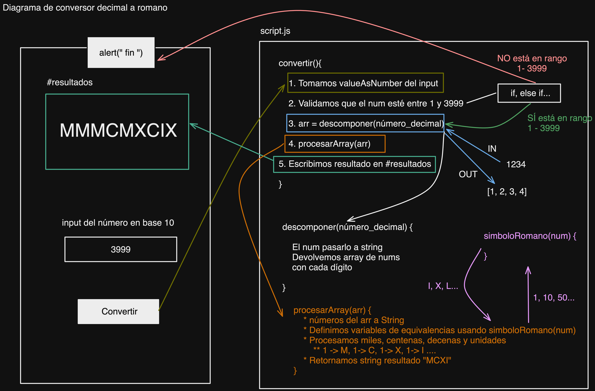

# Conversor de Decimal a Romano

Actualmente, el conversor solo admite números entre `1` y `3999`.

## Cambios a considerar en el Conversor

- Usar bucles `for` para reducir repeticiónd de condiciones.
- Introducir/modificar variables necesarias
- Mejorar las salidas y entradas de funciones como `descomponer()`

## Trabajo Futuro

- Rehacer con bucles `for`, `map()`, `() => { ... }`etc.
- Extender para todo tipo de números enteros hasta donde permita la numeración romana.
- Considerar usar estas funciones para transformar años, fechas, etc.
- **Hacer un conversor inverso**, de números decimales a números romanos.
