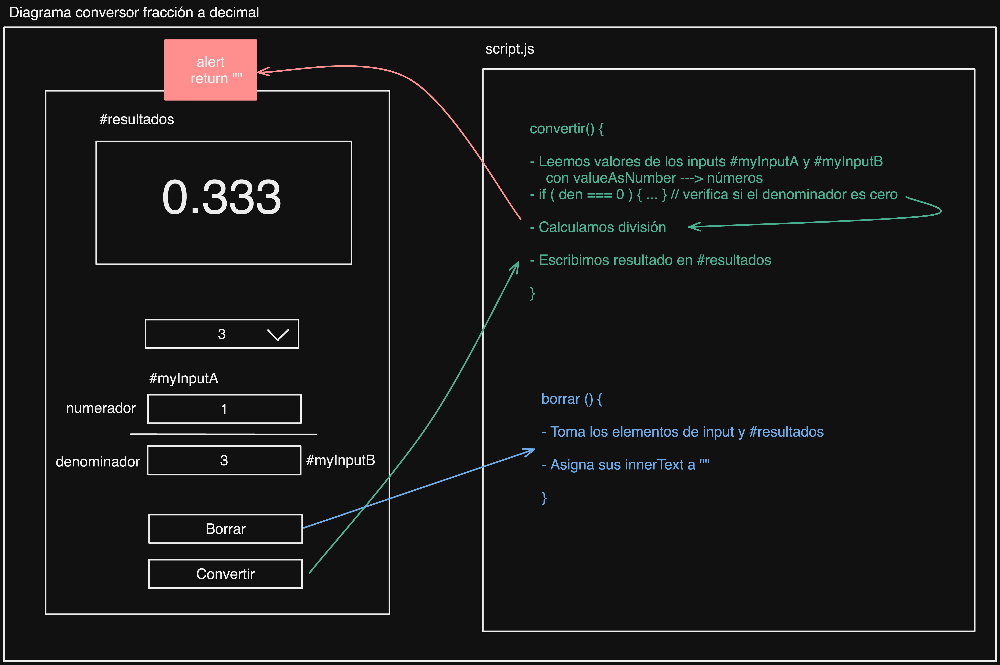

# Conversor de fracciones a decimal

Calcula la representación en base 10 de una fracción. Excluye la división por cero. Permite elegir el número de decimales hasta `12`.

## Trabajo Futuro

- Considerar el conversor inverso de decimal a fracción.
- Considerar más tipos de números (decimal, fracción, porcentajes).
- Enlazar herramientas entre sí.